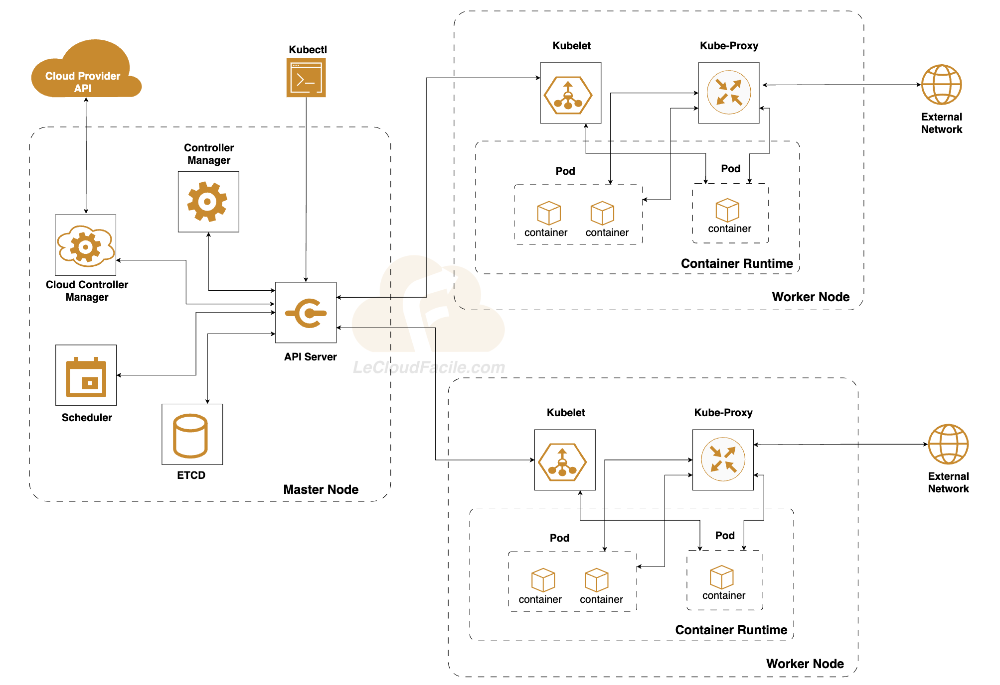

# Installation Kuberntes

Dans ce TP, nous allons mettre en place l'architecture suivante:



Ci-dessous les spécifications des serveurs.

<table>
    <tr>
        <th>Role</th>
        <th>Hostname</th>
        <th>Ressources</th>
        <th>FQDN</th>
    </tr>
    <tr>
        <td>Master</td>
        <td>srvlcfmaster01</td>
        <td>2 CPU / 4Go RAM</td>
        <td>srvlcfmaster01.lab.io</td>
    </tr>
    <tr>
        <td>Worker</td>
        <td>srvlcfworker01</td>
        <td>2 CPU / 4Go RAM</td>
        <td>srvlcfworker01.lab.io</td>
    </tr>
     <tr>
        <td>Worker</td>
        <td>srvlcfworker02</td>
        <td>2 CPU / 4Go RAM</td>
        <td>srvlcfworker02.lab.io</td>
    </tr>
</table>

## 1. Configuration des serveurs

> La configuration suivante sera appliquée à tous les nœuds du cluster


#### Configuration DNS

Tout d'abord, récuperez l'adresse IP des nœuds en exécutant la commande suivante:

```
ip a
```

Sur chaque noeud, éditez le fichier /etc/hosts et ajoutez le code suivant. N'oubliez pas de remplacer IP_node_master et IP_node_worker par les vôtres :

```
<IP_node_master> srvlcfmaster01.lab.io srvlcfmaster01

<IP_node_worker_1> srvlcfworker01.lab.io  srvlcfworker01

<IP_node_worker_2> srvlcfworker02.lab.io  srvlcfworker02
```

#### Désactivation du Swap

Il est impératif de désactiver le swap. C'est une exigence du kubelet.

```
sudo swapoff -a
```

#### Activation & chargement de modules complémentaires

```
cat <<EOF | sudo tee /etc/modules-load.d/containerd.conf
overlay
br_netfilter
EOF

sudo modprobe overlay && sudo modprobe br_netfilter
```

#### Ajout de paramètres sysctl

```
cat <<EOF | sudo tee /etc/sysctl.d/99-kubernetes-cri.conf
net.bridge.bridge-nf-call-iptables  = 1
net.ipv4.ip_forward                 = 1
net.bridge.bridge-nf-call-ip6tables = 1
EOF

# Apply sysctl params without reboot
sudo sysctl --system
```


## 2. Installation et configuration du Container Runtime : containerd  

> La configuration suivante sera appliquée à tous les nœuds du cluster

#### Installation du package containerd

```
sudo yum-config-manager --add-repo https://download.docker.com/linux/centos/docker-ce.repo
sudo yum install containerd
```

#### Configuration de containerd

Remplacez la configuration par défaut en exécutant la commande suivante:

```
sudo mkdir -p /etc/containerd
containerd config default | sudo tee /etc/containerd/config.toml
```

Editez le fichier de configuration file /etc/containerd/config.toml and définir la valeur de la propriété SystemdCgroup à ***true***


```
    [plugins."io.containerd.grpc.v1.cri".containerd.runtimes.runc.options]
        BinaryName = ""
        CriuImagePath = ""
        CriuPath = ""
        CriuWorkPath = ""
        IoGid = 0
        IoUid = 0
        NoNewKeyring = false
        NoPivotRoot = false
        Root = ""
        ShimCgroup = ""
        SystemdCgroup = true
```

#### Démarrage du service containerd

```
sudo systemctl enable containerd
sudo systemctl restart containerd
sudo systemctl status containerd
```

## 3. Instalation des utilitaires: Kubectl, kubeadm, kubelet


> La configuration suivante sera appliquée à tous les nœuds du cluster


#### Activation du mode permissive pour SELinux

Ces instructions concernent les version  >= 1.29 de Kubernetes.

```
sudo setenforce 0
sudo sed -i 's/^SELINUX=enforcing$/SELINUX=permissive/' /etc/selinux/config
```

#### Ajout du repôt Kubernetes

```
cat <<EOF | sudo tee /etc/yum.repos.d/kubernetes.repo
[kubernetes]
name=Kubernetes
baseurl=https://pkgs.k8s.io/core:/stable:/v1.29/rpm/
enabled=1
gpgcheck=1
gpgkey=https://pkgs.k8s.io/core:/stable:/v1.29/rpm/repodata/repomd.xml.key
exclude=kubelet kubeadm kubectl cri-tools kubernetes-cni
EOF
```

#### Installation de kubelet, kubeadm and kubectl


```
sudo yum install -y kubelet kubeadm kubectl --disableexcludes=kubernetes
sudo systemctl enable --now kubelet
```

## 4. Boostrap du Cluster K8S

> La configuration suivante sera appliquée au nœud Master du cluster uniquement.

#### Initialisation du plan de contrôle

```
sudo kubeadm init --config kubeadm-config.yaml
```

NB: Le container runtime et le kubelet ont tous deux une propriété appelée « cgroup driver_ » et utilisée pour la gestion des cgroups sur les machines Linux.
Il est nécessaire d'utiliser le même driver (systemd dans notre cas), sinon le processus du kubelet échouera à l'exécution..

<br>

#### Configuration de kubectl

```
mkdir -p $HOME/.kube
sudo cp -i /etc/kubernetes/admin.conf $HOME/.kube/config
sudo chown $(id -u):$(id -g) $HOME/.kube/config
```

### Installation d'un plugin réseau CNI

<br>
Vous devez déployer un plugin réseau basé sur CNI(Container Network Interface) pour que vos pods puissent communiquer les uns avec les autres. Le cluster DNS (CoreDNS) ne démarrera pas avant l'installation du plugin réseau.

Calico est une solution open source de mise en réseau et de sécurité réseau pour les conteneurs, les machines virtuelles, etc.


```
kubectl apply -f https://docs.projectcalico.org/manifests/calico.yaml
```

Attendez quelques minutes et vérifiez les pods déployés dans le namespace kube-system.
Si tous les pods fonctionnent, cela signifie que le master est prêt.

Exécutez la commande suivante pour voir les pods dans tous les namespaces.

```
kubectl get pod --all-namespaces
```


## 5. Connexion des noeuds Worker au Cluster 

>La configuration suivante sera appliquée aux nœuds Worker du cluster

Exécuter cette commande, pour joindre les workers au cluster. Cette commande est affichée sur la sortie de la commande d'initialisation du cluster avec kubeadm.

```
sudo kubeadm join --token <token> <control-plane-host>:<control-plane-port> --discovery-token-ca-cert-hash sha256:<hash>
```
Après avoir joint le worker au cluster, vérifiez au bout de quelques minutes que tous les nœuds sont prêts. Veuillez exécuter la commande sur le noeud master.

```
kubectl get nodes
```

Votre cluster est maintenant prêt et vous pouvez vous réjouir de travailler avec k8s.
